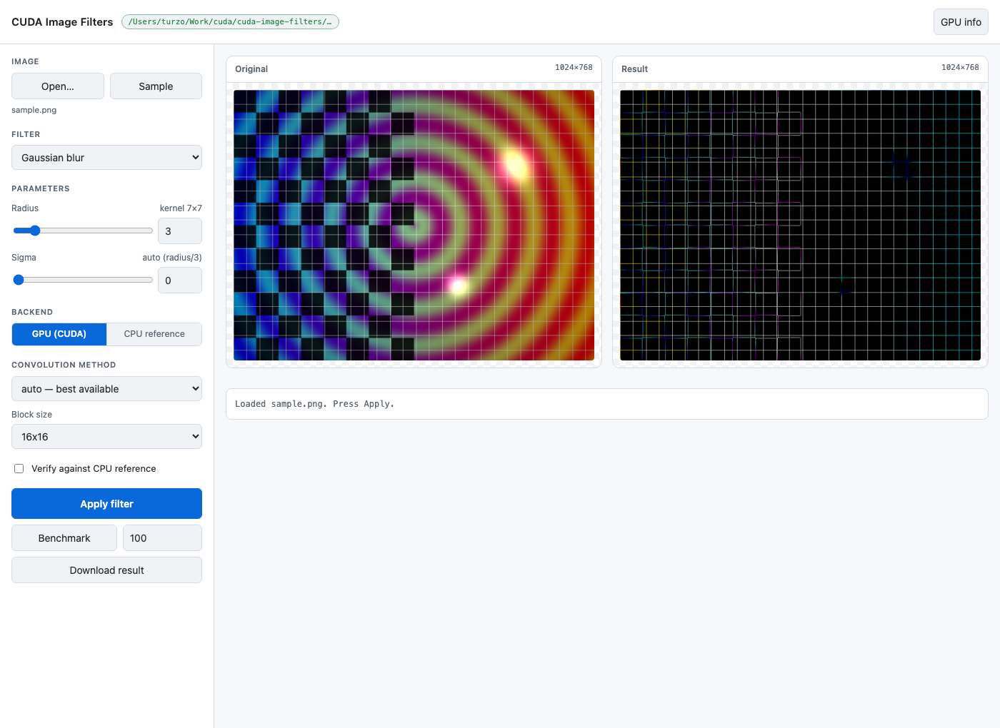

# cuda-image-filters

Real-time image processing filters in CUDA C++. Load any image, run a filter on
the GPU, write the result.

It is a learning project, so every convolution is implemented three ways —
naive, shared-memory tiled, and separable — and you can switch between them at
runtime and measure the difference. A CPU reference implementation of every
filter doubles as the correctness oracle.

```bash
cuda-filters -i photo.jpg -f gaussian -r 5 -o blurred.png
cuda-filters -i photo.jpg -f sobel -o edges.png
cuda-filters -i photo.jpg -k kernels/emboss.kernel -o embossed.png
cuda-filters -i photo.jpg -f gaussian -r 8 --bench 200
```

## What it covers

| Area | Where |
|---|---|
| `cudaMalloc` / `cudaMemcpy`, RAII device buffers | [`include/cuda_utils.cuh`](include/cuda_utils.cuh) |
| 2D grid/block indexing, bounds guards, coalescing | [`src/cuda/grayscale.cu`](src/cuda/grayscale.cu) |
| `__constant__` memory for broadcast reads | [`src/cuda/convolution.cu`](src/cuda/convolution.cu) |
| Shared-memory tiling with a halo | [`src/cuda/convolution.cu`](src/cuda/convolution.cu) |
| Separable convolution, two passes | [`src/cuda/convolution.cu`](src/cuda/convolution.cu) |
| `cudaEvent` timing, effective bandwidth | [`src/cuda/convolution.cu`](src/cuda/convolution.cu) |
| GPU vs CPU verification | [`src/verify.cpp`](src/verify.cpp) |

The reasoning behind the optimisation work is in
[`docs/optimisation-notes.md`](docs/optimisation-notes.md).

## Requirements

- An NVIDIA GPU with compute capability 6.0 or newer (GTX 10-series onward)
- [CUDA Toolkit](https://developer.nvidia.com/cuda-downloads) 11.0 or newer
- CMake 3.18+ **or** just `make`
- A C++17 host compiler (GCC, Clang, or MSVC on Windows)

Nothing else. The image codecs are vendored in `third_party/stb`, so there is
no package manager step and no network access needed at build time.

Check the toolkit is visible:

```bash
nvcc --version
nvidia-smi
```

## Build

### Linux / WSL / macOS-with-CUDA

```bash
git clone https://github.com/YOUR_USERNAME/cuda-image-filters.git
cd cuda-image-filters

cmake -B build -DCMAKE_BUILD_TYPE=Release
cmake --build build -j
```

The binary lands at `build/cuda-filters`.

Or without CMake:

```bash
make -j
./cuda-filters --help
```

### Windows

```powershell
cmake -B build -G "Visual Studio 17 2022" -A x64
cmake --build build --config Release
.\build\Release\cuda-filters.exe --help
```

### Targeting a specific GPU

The build defaults to `native`, which detects the card in the machine doing the
build. That needs CUDA 11.5+ and CMake 3.24+. If you have an older toolkit, or
you are building on one machine to run on another, name the architecture:

```bash
cmake -B build -DCMAKE_CUDA_ARCHITECTURES=86     # RTX 30-series
make CUDA_ARCH=75                                 # RTX 20-series / GTX 16-series
```

| GPU family | Architecture |
|---|---|
| GTX 10-series (Pascal) | 61 |
| RTX 20-series, GTX 16-series (Turing) | 75 |
| RTX 30-series (Ampere) | 86 |
| RTX 40-series (Ada) | 89 |
| RTX 50-series (Blackwell) | 120 |

## The UI

There is a small web UI for trying filters without retyping commands: load an
image, pick a filter or type your own convolution matrix, see the result and
the kernel timings side by side.

```bash
make ui                      # or: python3 gui/server.py
```

It opens <http://127.0.0.1:8765>. Standard library Python only — nothing to
`pip install`, and it works the same on Linux, Windows and macOS. It shells
out to the same `cuda-filters` binary, so what you see is the real GPU path.



What it gives you over the CLI:

- drag and drop an image, or use the bundled sample
- a live matrix editor with validation as you type, preloaded from
  `kernels/*.kernel`, and a button to save your own back into `kernels/`
- backend, `--method` and block size as controls, so you can watch tiled vs
  naive vs separable on your own image
- kernel/upload/download timings after every run, and `--verify` as a checkbox
- `--bench` from a button

It binds to `127.0.0.1` only. It runs a local binary with arguments from the
page, so do not expose it to a network.

## First run

```bash
./cuda-filters --list-devices        # confirm the GPU is visible
make sample                          # regenerate assets/sample.png (already committed)
./cuda-filters -i assets/sample.png -f gaussian -r 5 -o blur.png
./scripts/demo.sh                    # render every filter into out/
```

## Filters

| Filter | What it does | Relevant flags |
|---|---|---|
| `grayscale` | Rec.601 luma, writes 1 channel | |
| `invert` | per-pixel negative | |
| `box` | box blur | `-r` |
| `gaussian` | gaussian blur | `-r`, `-s` |
| `sharpen` | unsharp mask | `-r`, `-s`, `--amount` |
| `emboss` | directional relief | |
| `laplacian` | second-derivative edges | |
| `sobel` | gradient magnitude, writes 1 channel | |
| `tonemap` | extended Reinhard tone mapping | `--exposure`, `--white`, `--gamma` |
| `custom` | any matrix from a file | `-k` |

Input can be PNG, JPG, BMP, TGA, GIF, PSD or PNM. Output format follows the
extension you give it: `.png`, `.jpg`, `.bmp` or `.tga`.

```bash
./cuda-filters -i photo.jpg -f gaussian -r 8 -s 3.0 -o soft.png
./cuda-filters -i photo.jpg -f sharpen -r 2 --amount 2.0 -o crisp.png
./cuda-filters -i photo.jpg -f tonemap --exposure 2.5 --white 3.0 -o graded.png
./cuda-filters -i photo.jpg -f sobel -o edges.png
```

## Custom kernels

Any odd-sided square matrix in a text file:

```
# kernels/outline.kernel
name outline

-1 -1 -1
-1  8 -1
-1 -1 -1
```

```bash
./cuda-filters -i photo.jpg -k kernels/outline.kernel -o outlined.png
```

`--kernel` implies `--filter custom`. Seven presets ship in
[`kernels/`](kernels/) — identity, outline, emboss, sharpen, 5x5 box, 9x9
diagonal motion blur and sobel-x. The format and the rules for writing your own
are in [`kernels/README.md`](kernels/README.md).

Rules of thumb: weights summing to **1** preserve brightness, weights summing
to **0** keep only edges (add `bias 128` to see negative values), a large
positive centre with a negative surround sharpens, and an asymmetric matrix
gives a directional effect.

## The optimisation

Three implementations of the same convolution, selectable at runtime:

| `--method` | How it works | Taps per pixel |
|---|---|---|
| `naive` | every tap read from global memory | K² |
| `tiled` | block stages a tile + halo in shared memory | K², from shared |
| `separable` | two 1D passes | 2K |
| `auto` | separable if the matrix allows, else tiled if it fits, else naive | |

Measure them on your own card:

```bash
./cuda-filters -i assets/sample.png -f gaussian -r 8 --bench 200
```

```
benchmark  1024x768x3, gaussian 17x17 (sum 1.000, separable), block 16x16, 200 iterations
           tile for radius 8 needs 36 KiB of shared memory (fits)

method          ms/iter   Mpixel/s    GB/s eff.   vs naive
------          -------   --------    ---------   --------
naive            ...        ...          ...         1.00x
tiled            ...        ...          ...         ....x
separable        ...        ...          ...         ....x
cpu (1 run)      ...        ...            -         ....x
```

The numbers are left blank on purpose — they depend entirely on your GPU, and
quoting someone else's would be meaningless. Run it and see.

What to expect: tiling beats naive, and the margin widens with the radius until
the halo gets too big. Separable beats both, by a margin that keeps growing,
because it is an algorithmic improvement rather than a constant factor. The
full reasoning, including the mistakes that cost the most time, is in
[`docs/optimisation-notes.md`](docs/optimisation-notes.md).

Other knobs worth turning:

```bash
--block 8x8      # smaller blocks: more of them, bigger halo overhead
--block 32x8     # non-square: changes the halo-to-output ratio
-r 1 ... -r 16   # watch tiled pull ahead of naive, then separable pull ahead
```

## Verifying correctness

A GPU kernel with an indexing bug produces an image that looks *approximately*
right, and eyeballing it will not find the bug. `--verify` runs the CPU
reference over the same input and diffs the two:

```bash
./cuda-filters -i assets/sample.png -f gaussian -r 4 --method tiled --verify
```

```
verify  exact match: every one of 2359296 channel values is identical
```

It exits non-zero when the difference is larger than float rounding explains.
The tolerance is 1, which is measured rather than assumed: the separable path
and `powf` accumulate in a different order from the reference and move a
handful of values by one. Every other path comes out exact, because the kernels
and the reference call the same inline helpers in
[`include/pixel_ops.hpp`](include/pixel_ops.hpp).

Full pass, host tests plus 18 GPU-vs-reference cases:

```bash
make test              # host-only unit tests (C++ and python), no GPU needed
./tests/run_tests.sh   # everything, skips stage 2 if there is no device
```

## Layout

```
include/          headers; cuda_utils.cuh is the CUDA-specific one
src/              host code: CLI, image I/O, kernel matrices, CPU reference
src/cuda/         the kernels
kernels/          custom convolution matrices
gui/              local web UI (stdlib python, no dependencies)
scripts/          sample image generator, demo renderer
tests/            unit tests and the full test runner
docs/             notes on the optimisation work
third_party/stb/  vendored image codecs
```

Only the `.cu` files go to `nvcc`; `main.cpp` and the rest are plain C++ and
never include `<cuda_runtime.h>`. That boundary is what lets `--backend cpu`
and the unit tests build and run on a machine with no CUDA at all.

## Troubleshooting

**`nvcc: command not found`** — the toolkit is not on `PATH`. On Linux it is
usually `/usr/local/cuda/bin`:

```bash
export PATH=/usr/local/cuda/bin:$PATH
export LD_LIBRARY_PATH=/usr/local/cuda/lib64:$LD_LIBRARY_PATH
```

**`no usable CUDA device`** — check `nvidia-smi` works. If it does not, the
driver is the problem, not this project. Inside WSL you need a recent Windows
driver with WSL2 GPU support.

**`unsupported GNU version` / host compiler too new** — each CUDA release
supports host compilers up to a specific version. Point it at an older one:

```bash
cmake -B build -DCMAKE_CUDA_HOST_COMPILER=/usr/bin/g++-12
```

**Kernel launch fails with `too many resources requested`** — the block is too
large for the kernel's register use. Try `--block 16x16` or `--block 8x8`.

**Tiled is slower than naive** — likely a small radius, where the halo
outweighs what tiling saves, or a debug build. Make sure you configured with
`-DCMAKE_BUILD_TYPE=Release`.

**The UI says `cuda-filters not found`** — build the binary first, or point the
server at it: `python3 gui/server.py --binary build/cuda-filters`.

**No GPU at all** — everything still works on the CPU (the UI has a
*CPU reference* toggle for this):

```bash
./cuda-filters -i photo.jpg -f gaussian -r 5 --backend cpu -o blur.png
```

## License

MIT. `third_party/stb` is public domain (MIT dual-licensed) by Sean Barrett.
